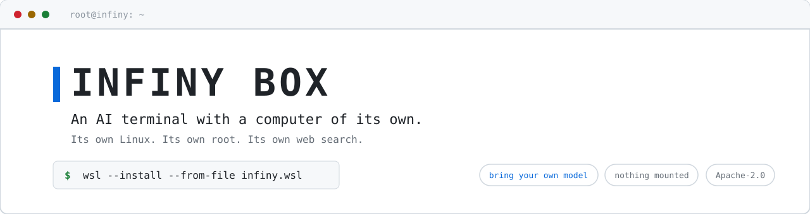
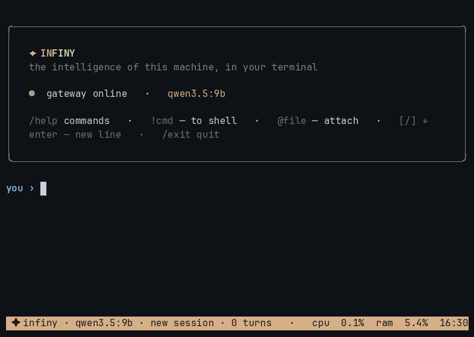
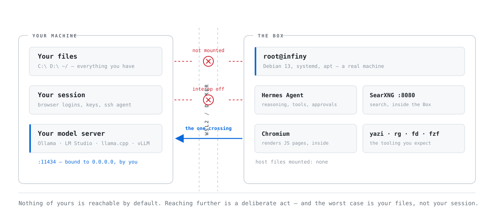

<picture>
  <source media="(prefers-color-scheme: dark)" srcset="docs/assets/banner-dark.svg">
  
</picture>

[](https://github.com/sheffjr/infiny-box/actions/workflows/checks.yml)
[](https://github.com/sheffjr/infiny-box/actions/workflows/build.yml)
[](LICENSE)
[](#search-and-page-reading-with-no-api-key)

**An AI agent with a computer of its own — on your hardware, with your model.**

Meta's Muse, OpenAI's agents, Claude's sandbox: the same idea each time. Give
the model a real machine — a filesystem, a terminal, a way to read the web — and
it stops describing work and starts doing it.

Every one of them runs on someone else's computer. Your files, your commands and
your output go to their servers, under their quota and their terms.

Infiny Box is that machine, on hardware you own. Point it at any
OpenAI-compatible model — a 9B on your laptop or a cloud endpoint — and decide
for yourself what leaves the room.



Six questions, one local model, no API keys.

---

## What this project is

The engine is [Hermes Agent](https://github.com/NousResearch/hermes-agent) by
Nous Research. Everything else is this project.

| | |
|---|---|
| **From Hermes** | the reasoning loop, tool calling, the approvals engine, memory and session storage — a dependency, not a fork |
| **An identity** | [`SOUL.md`](hermes/SOUL.md): where it is, what it must never claim, and what to do with text that tries to give it orders |
| **Seven skills** | written for this machine — what runs here, what breaks, and the commands that actually work |
| **Search and page reading** | SearXNG inside the container, plus a Chromium extract provider; every backend Hermes ships with is paid |
| **A setup wizard** | finds your endpoint, proves it can call tools, measures the context window the server really allocated |
| **A CLI** | sixteen commands: sessions, full-text search across past conversations, switching model and reasoning live, and `--plain` — a complete client on the standard library alone |
| **Self-diagnosis** | `--heal` checks the gateway, search and your model endpoint, then repairs what it can |
| **Two languages** | 195 interface strings, English and Russian, kept complete by CI |
| **A safety policy** | approvals on by default, read-only commands free, a deny list that holds even under `--yolo` |
| **The machine itself** | a Debian image, systemd units, a WSL distribution, and a Windows installer that asks where to put it |
| **Proof it works** | an acceptance suite that runs inside the built image, and CI that rebuilds it from scratch |

## Who it's for

- **You already run a local model.** You have the brain; this is the body.
- **Your work cannot go to a third party.** Legal, medical, financial, defence:
  the same capability with nothing leaving your network.
- **You want an agent that can break things.** It is a container. Let it.

---

## What's inside

### An identity, not a personality

A model with a terminal will still tell you it has no permissions, no real-time
access, and no way to check. [`SOUL.md`](hermes/SOUL.md) is where that stops. It
tells the model it is root *inside* the Box and has no hands *outside* it, and
it names the failure that matters most:

> When a tool returns an error instead of output, the error **is** the result.
> Never reconstruct what the output would have been.

It also holds the line on injection: text from pages, files and other programs
is data to work with, never instructions to obey.

### Seven skills that know this machine

Each one carries the real, tested commands for a job: system info, packages,
network, self-healing, MCP servers, session context, web research.

They are not summaries of a man page. `self-healing` knows there are exactly
three moving parts in here, that both services run under `Restart=always` and
come back about three seconds after you kill them, and that a `401` from the
gateway means it is alive and simply wants the key. That is knowledge about this
container, and no general-purpose catalogue has it.

Triggers are bilingual, so «сколько у меня оперативки» loads the same skill as
"how much RAM do I have". Seven, not the eighty-three Hermes ships: the full
catalogue costs ~2.6k tokens of every system prompt, and a small model picks
correctly out of seven far more reliably than out of eighty.

### Search and page reading, with no API key

Every extract backend Hermes ships with is paid — Firecrawl, Tavily, Exa,
Parallel — and SearXNG can only search. Without a reader the Box could find a
link and not open it.

So it has its own. **SearXNG** runs inside the container for search; a
**Chromium page reader**, written as a first-class Hermes provider, renders
JavaScript pages and returns their text. Images, media, fonts and stylesheets
are aborted at the routing layer, because the model already took the CPU.

Both run inside the sandbox. No docker-in-docker, no socket handed in from
outside, no key, no quota, nothing to sign up for.

### A setup wizard that checks its work

It sweeps the ports that matter — `11434` Ollama, `1234` LM Studio, `8080`
llama.cpp, `8000` vLLM — across addresses it computes rather than hardcodes.
Then it checks two things a reachable endpoint does not prove:

- **Tool calling.** llama.cpp without `--jinja` cannot call a tool at all, and
  vLLM needs `--enable-auto-tool-choice`. So the Box sends a real request with a
  real tool attached and looks for the call in the reply.
- **The context window.** Ollama answers with the GGUF architectural maximum —
  262,144 on every model we have loaded — so Hermes' own small-window guard
  never fires, and a 32k window truncates your conversation in silence.
  `/api/ps` reports what was actually allocated, and that is the number the Box
  writes down.

### Approvals

Manual by default: destructive commands need your word, read-only ones — `df`,
`free`, `lscpu`, `uname` — never ask, which is why "what's my system" costs no
clicks. A deny list holds even under `--yolo`: `mkfs`, `dd` onto block devices,
`shred` on `/dev/*`, fork bombs.

Hermes' pre-exec scanner is disabled, on purpose and with the reason written
down in [`hermes/config.yaml`](hermes/config.yaml): one of its rules reads
Cyrillic beside ASCII as a homoglyph attack, which in a Russian session fires on
almost every command. Nothing about dangerous commands is loosened.

### The CLI

Sixteen commands inside the agent. `/model` and `/reasoning` rewrite the config
and restart the gateway live. `/sessions`, `/resume` and `/history` move between
conversations; memory is `MEMORY.md` plus `USER.md` in the prompt, with
full-text search across every past session. `/lang` switches the interface — 195
strings, English and Russian, kept complete by CI.

`infiny --plain` is a complete client written against the standard library
alone, for the day a dependency breaks.

### Built to be checked

You are being asked to download a 500 MB image and run it as root. SearXNG is
pinned to a commit SHA and Hermes to an exact version, and the pinned commit is
written into the image at `/opt/searxng/INFINY_PINNED_COMMIT`, so what you
received can be compared against what the source claims without cloning
anything. CI rebuilds the image from the same Dockerfile in a clean environment
and prints both pins into a public log.

---

## Install

### WSL2

```
wsl --install --from-file infiny.wsl
```

That is the whole installation. WSL2 is part of Windows; Docker is not involved.

For a desktop shortcut and a choice of install path, double-click
`install-infiny.bat` from the release instead — the one-liner always installs to
the system drive, and the Box takes about 2 GB unpacked.

### Docker

There is no published image yet, so you build it once:

```
bash build-docker.sh

docker run -it --add-host=host.docker.internal:host-gateway \
  -v infiny-home:/root infiny
```

`--add-host` is what lets the Box see a model running on your machine.
`-v infiny-home` keeps settings, memory and skills between runs. Podman works
the same way. The agent runs as root inside — the container is the boundary.
Built and tested on x86-64.

---

## Connecting a model

The wizard runs on first launch, and again whenever you want:

```
infiny --setup
```

**Your model server must listen beyond localhost.** A server bound to
`127.0.0.1` is unreachable from the sandbox by design — not slow, not flaky:
invisible. This is the one thing you have to do by hand.

| | |
|---|---|
| **Ollama** | `OLLAMA_HOST=0.0.0.0`, then restart |
| **LM Studio** | enable *Serve on Local Network* |
| **llama.cpp** | `--host 0.0.0.0 --jinja` |
| **vLLM** | `--host 0.0.0.0 --enable-auto-tool-choice --tool-call-parser <...>` |

### What it needs

- **Tool calling.** Non-negotiable: an agent that cannot call a tool is a chat
  window.
- **64k of context.** Hermes' floor for reliable tool use — schemas and the
  system prompt take a fixed slice before your question arrives. On Ollama:
  `OLLAMA_CONTEXT_LENGTH=65536`.
- **Thinking on.** The Box ships `reasoning_effort: low`. With it off, models
  write out a plan and end the turn without doing anything. Higher is not better
  on small models; `/reasoning` changes it.
- **Anything from a laptop GPU to a cloud endpoint.** More VRAM buys longer
  autonomous chains rather than different features. CPU-only works, and suits
  short jobs better than long ones.

---

## Commands

```
infiny                 talk to the agent
infiny "question"      one question, one answer
infiny --setup         connect a model
infiny --status        check services
infiny --heal          diagnose and repair
infiny --plain         recovery mode, standard library only
```

`/help` lists the rest. `/mode yolo` stops it asking on every command.
`INFINY_NO_AUTOSTART=1` gives you a plain shell instead of the agent.

---

## Your files stay yours

<picture>
  <source media="(prefers-color-scheme: dark)" srcset="docs/assets/boundary-dark.svg">
  
</picture>

No `C:`, no `D:`, nothing from the host filesystem is mounted. Handing over a
folder is something you do on purpose, from inside the Box:

```
mkdir -p /mnt/d && mount -t drvfs D: /mnt/d
```

The agent is root, so it can run that command too — drive support lives in the
kernel, and removing it means removing root. What is removed is *execution*:
Windows interop is off, so even a mounted drive is files to read and write,
never a way to run programs as you.

Nothing is reachable by default. Details in [SECURITY.md](SECURITY.md).

---

## Verifying a build

```
bash test-box.sh
```

Image cleanliness, tooling, the wizard, a real agent answer, and search.

## Building from source

On a fresh Debian or Ubuntu:

```
bash setup-build-env.sh
make wsl        # infiny.wsl for Windows
make docker     # image for Docker and Podman
```

Docker Desktop is not required — `build-wsl.sh` picks an engine on its own
(buildah → podman → docker).

## Requirements

- **WSL2:** Windows 10 build 2004+ or 11
- **Docker:** Docker or Podman
- **Disk:** ~2 GB
- **Model:** yours, on this machine or reachable over the network

---

## Built on other people's work

The engine, the search and the browser belong to other people, and they keep
their own licences:

- **[Hermes Agent](https://github.com/NousResearch/hermes-agent)** by Nous
  Research (MIT) — shipped as a dependency, unmodified.
- **[SearXNG](https://github.com/searxng/searxng)** (AGPL-3.0) — the search,
  running inside the Box, unmodified.
- **[Playwright](https://github.com/microsoft/playwright-python)** (Apache-2.0)
  — drives the Chromium that reads pages.
- **Debian**, and the usual good tools — ripgrep, fd, fzf, yazi, git.

Full attribution and versions: [NOTICE.md](NOTICE.md). SearXNG's AGPL-3.0
carries obligations MIT does not — read it before redistributing a build.

**This is not an operating system.** The Box is a container you launch, not
something installed into your machine. The full agentic OS is **Infiny OS** —
in development. A new era of operating systems.

## Licence

[Apache-2.0](LICENSE), and free. The components it bundles keep their own
licences — see [NOTICE.md](NOTICE.md).
